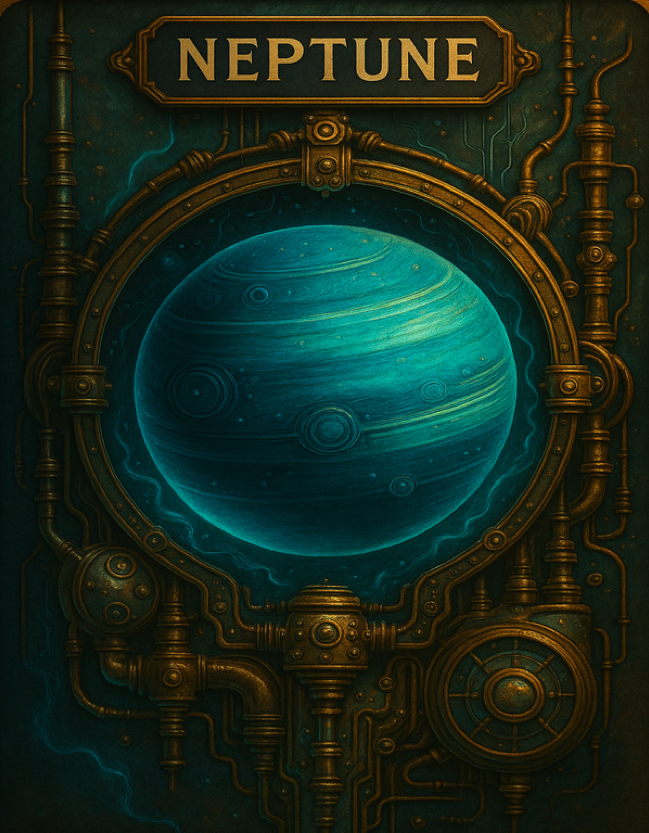

# WEB3_MEMORY_GAME_DOUBLE_OR_NOTHING_(VSCODE_TESTADMINIA)

**Amy Newkirk, Information Lead, 2025 April 29**  
**Time Estimate:** 2–3 hours total  
Programming: 1 hour  
Unit Tests: 1–2 hours  

Create a working Web3 card game like you're making toast—with just a few more steps and fewer crumbs.

---



---

## 🔧 SECTIONS

**DIAGRAM: FILE DIRECTORY STRUCTURE**  
Includes:  
Frontend  
Backend  
VS Code structure for new feature files

**HOW THE GAME WORKS**  
A digital twist on memory match using React + Node.js + optional MetaMask incentives.

**IMPROVEMENT SUGGESTIONS**  
Includes TypeScript conversion, test coverage, monitoring, tokenomics clarity, and refactoring.

**BASE ENVIRONMENT SETUP**  
Node.js, VS Code, MongoDB, and Vitest or Jest

**ADDITIONAL IMPROVEMENT: TESTADMINIA MEMORY GAME**  
Includes:  
Double or Nothing Feature Integration  
Service design and customer engagement enhancement  
Credit Context File (.tsx, React + TypeScript)  
All-In Component (.tsx)  
Frontend Integration  
Backend Endpoints  
Logic Framework for KPIs  
NPS and Likert feedback tracking  
Code snippets for engagement tracking

**UNIT TESTING**  
Tests for:  
AllInComponent  
CardComponent  
API GET /cardsx  
CreditContext  
MongoDB Insertion

---

## 📁 FILE DIRECTORY STRUCTURE

```plaintext
root/
├── backend/
│   ├── index.ts
│   ├── routes/api.ts
│   └── tests/
│       ├── api.test.ts
│       ├── APICards.test.ts
│       ├── MongoInsert.test.ts
│       ├── 04-UNIT_TEST_API GET|cards.docx
│       ├── 06-UNIT_TEST_MongoDB Insertion.docx
│       ├── TestResults_API_GetCards.txt
│       ├── TestResults_MongoDB_Insertion.txt
│       └── README.md
├── frontend/
│   ├── index.html
│   ├── vite.config.ts
│   ├── package.json
│   ├── src/
│   │   ├── App.tsx
│   │   ├── Game.tsx
│   │   ├── main.tsx
│   │   ├── components/
│   │   │   ├── AllIn.tsx
│   │   │   ├── Card.tsx
│   │   │   ├── 02-UNIT_TEST_AllInComponent.docx
│   │   │   ├── 03-UNIT_TEST_CardComponent.docx
│   │   │   ├── TestResults_AllInComponent.txt
│   │   │   ├── TestResults_CardComponent.txt
│   │   │   └── README.md
│   │   ├── context/
│   │   │   ├── CreditContext.tsx
│   │   │   ├── 05-UNIT_TEST_CreditContext.docx
│   │   │   ├── TestResults_CreditContext.txt
│   │   │   └── README.md
│   │   ├── MemoryCardGame/
│   │   │   ├── MemoryCardGame.tsx
│   │   │   ├── CardUtils.tsx
│   │   │   ├── Play.tsx
│   │   │   └── MemoryEasy.tsx
│   │   └── tests/
│   │       ├── AllInComponent.test.tsx
│   │       ├── CardComponent.test.tsx
│   │       ├── CreditContext.test.tsx
│   │       └── README.md
│   └── assets/images/audio/
├── README.md
├── package.json
├── 01-WEB3_MEMORY_GAME_DOUBLE_OR_NOTHING_(VSCODE_TESTADMINIA).docx
└── AmyNewkirkTechLead.png
```

---

## 📘 CONTINUED CONTENT

_(Full instructional content, code blocks, setup, integration steps, unit test examples, and logic framework as you detailed will continue in the file below.)_

